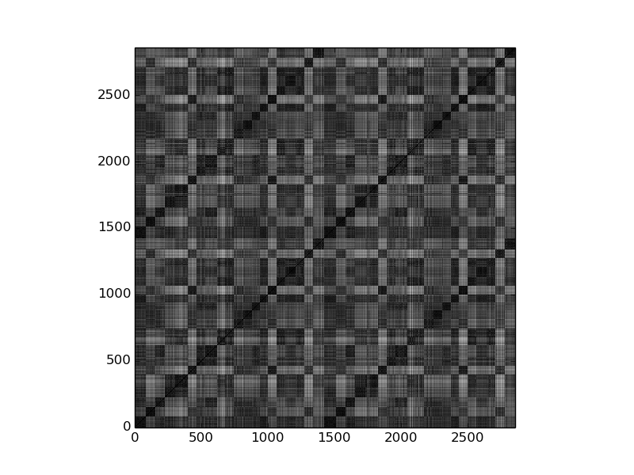
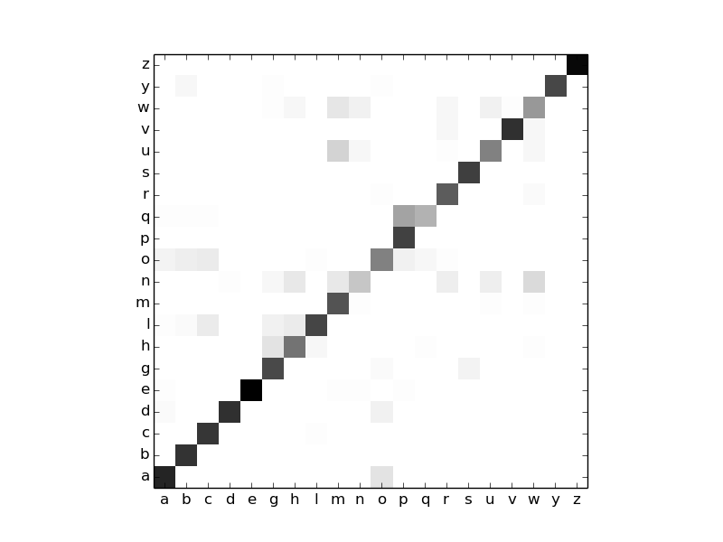

# DTW based Affinity Propagation Clustering

AP Clustering using DTW distance for temporal sequences classification.

## CharacterTrajectory

[Data Download](http://timeseriesclassification.com/description.php?Dataset=CharacterTrajectories)

[Dataprocess](https://github.com/SongDark/timeseries_infogan/blob/master/dataprocess.py)

### Time Consumption

N| N(N-1)/2| np_dtw (r=10) | np_dtw_parallel (r=10, cpu=15) |tf_dtw (batches) |
:---: | :---:| :---: | :---: | :---:
10 | 45 | 8.07s | 1.29s | 16.31s (1)
50 | 1,225 | 229.88 | 26.60 |72.30 (5)
100 | 4,950 | 959.57 | 102.74 |72.97 (5)
200 |19,900 |  about 4k (1.1h) | 402.69 |77.13 (5)
1,000 | 499,500 | about 100k (27h) | about 10k (2.8h) |795.20 (50)
2,858 | 4,082,653 | about 784k (9d) | about 78.4k (21h) |6476.16 (400)

### Results

Accuracy is **86.85%** in train_set and **83.43%** in test_set.

DTW Matrix | Confusion Matrix
:---:| :---:
 | 

